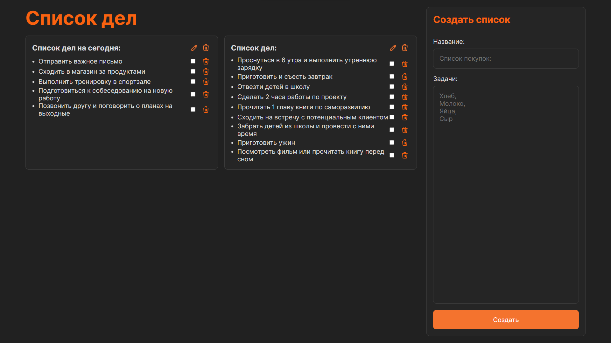
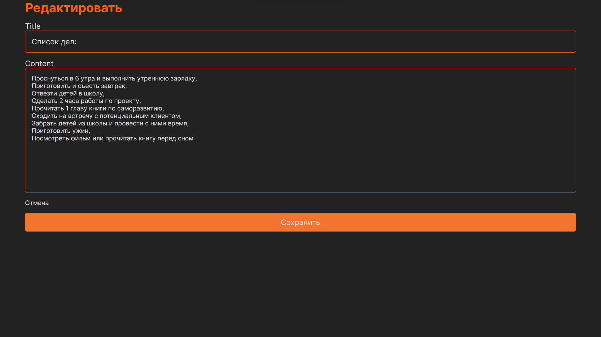
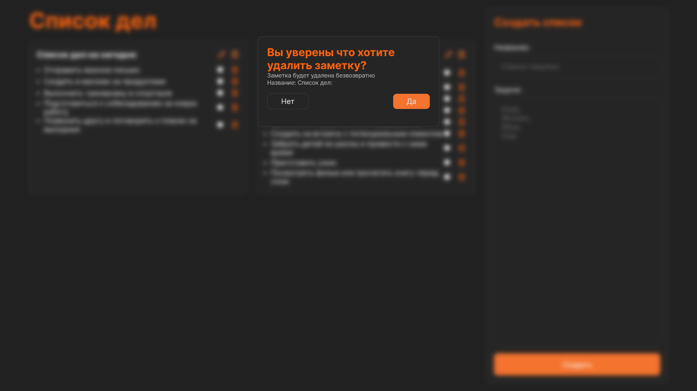

# Todo List

Автор: Ернияз Талғатұлы

технология: React

Ссылка на проект: http://tyernifr.beget.tech/ (проект находится на бесплатном хостинге, поэтому может быть недоступен)

Тестовое задание для компании [Codebase.kz](https://www.instagram.com/codebase.kz/) на позицию Frontend Developer.

## Задание

Приложение для создания списка дел. Приложение должно иметь следующие функции:

- Просмотр списка дел
- Добавление нового дела
- Название дела
- Удаление дела
  - Подтверждение удаления дела "Без функции Alert или Confirm"
- Редактирование дела
- Пометка дела как выполненного
- Пометка дела как невыполненного
- Сохранение списка дел в localStorage
- Работа с приложением без перезагрузки страницы

## Устоновка

1. Склонировать репозиторий
2. Установить зависимости `npm install`
3. Запустить приложение `npm start`
4. Приложение будет доступно по адресу `http://localhost:3000/`

## Стек

- React
- React Router
- React redux
- Redux toolkit
- nanoid

## Скриншоты

### * Главная страница

### * Редактирование дела

### * Удаление дела

